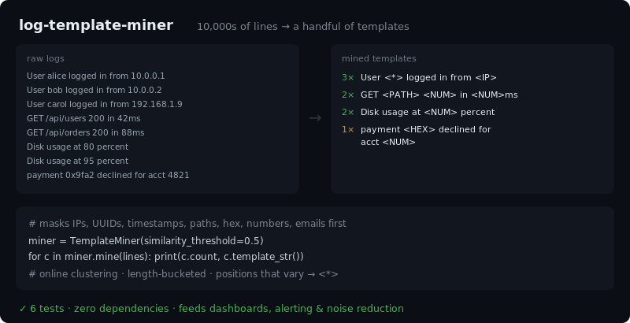

# log-template-miner

[](https://github.com/JCreatesGH/log-template-miner/actions)
[](https://www.python.org/)
[](LICENSE)

Collapse millions of noisy log lines into a handful of **templates** — a small, dependency-free [Drain](https://github.com/logpai/Drain3)-style miner. The foundation for log analytics, anomaly detection, and noise reduction in Splunk / ELK / Loki pipelines.



## Install

```bash
pip install logminer
```

## Use it

```python
from logminer import TemplateMiner

miner = TemplateMiner(similarity_threshold=0.5)
for c in miner.mine(open("app.log")):
    print(c.count, c.template_str())

# 3   User <*> logged in from <IP>
# 2   GET <PATH> <NUM> in <NUM>ms
# 2   Disk usage at <NUM> percent

# Classify a new line against a trained miner without changing it:
miner.match("User dave logged in from 10.0.0.9")   # -> that cluster (or None)

# …or pull the *values* out of a matched line (template + the variable parts):
cluster, params = miner.extract("User dave logged in from 10.0.0.9")
# cluster.template_str() -> "User <*> logged in from <IP>"
# params                 -> ["dave", "10.0.0.9"]
```

## CLI

Installing the package adds a `logminer` command — point it at a file or pipe logs in:

```bash
$ logminer app.log               # templates, most frequent first
$ tail -f app.log | logminer     # works on a stream
$ logminer app.log --top 10 --json
```

Flags: `-t/--threshold`, `-n/--top`, `--no-mask`, `--json`.

## How it works

1. **Mask** obvious variables first — IPs, UUIDs, MACs, timestamps, URLs, paths, hex, hash/SHA-style ids, emails, and numbers (ints *and* floats) become typed placeholders (`<IP>`, `<URL>`, `<ID>`, `<NUM>`, …).
2. **Bucket** lines by token count.
3. **Cluster online** — each line is matched against existing templates by positional similarity; on a match, positions that differ collapse to `<*>`, otherwise a new template is created.

It's streaming (`add_log` one line at a time) and ordered by frequency (`top()`), so you immediately see which messages dominate your logs. `extract()` then recovers the actual variable values behind any line — turning unstructured logs into `(template, params)` pairs you can index or alert on.

## Development

```bash
pip install -e .[dev] && python -m pytest -q   # 15 tests
```

## License

MIT
